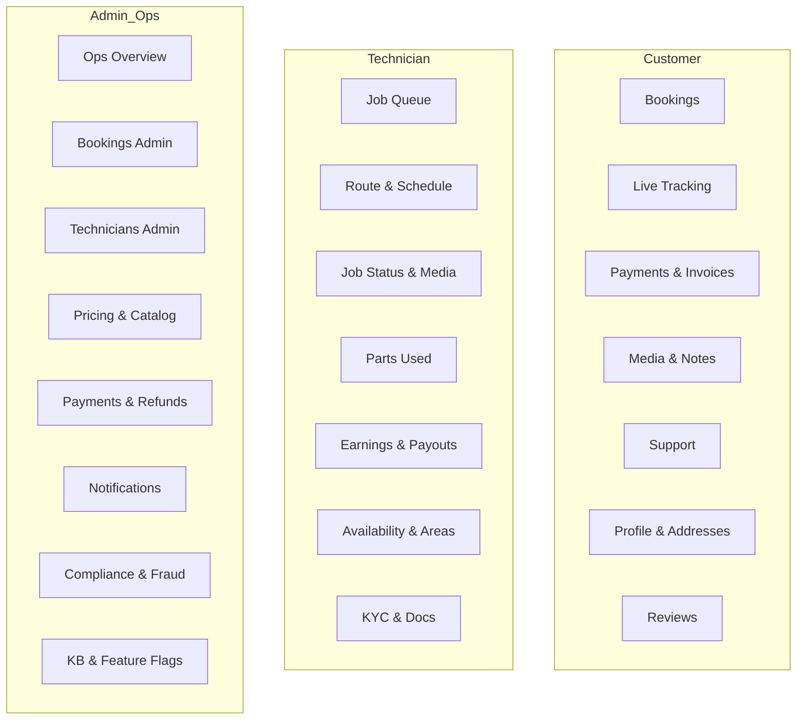

# Flow — Roles and Responsibilities

## Scope
This document explains the roles in InstantFix and exactly what each role can do. Use it to align product, design, and engineering.

---

## Roles Overview
- Customer
- Technician
- Admin/Ops

---

## Customer
- **Bookings**
  - Create new booking with address, timeslot, and issue details
  - View upcoming/past bookings
  - Reschedule or cancel within policy
- **Live Tracking**
  - See technician ETA, location, contact, and status updates
- **Payments & Invoices**
  - Pay securely (UPI/cards), view/download invoices
  - Handle refunds when applicable
- **Media & Notes**
  - Upload issue photos/videos and add notes
- **Support**
  - In-app chat, FAQs, raise tickets
- **Profile**
  - Manage profile, addresses, notification preferences
- **Reviews**
  - Rate completed jobs and leave feedback

---

## Technician
- **Job Management**
  - View available jobs (accept/decline) based on skills/area
  - Today’s route and schedule
  - Job details, customer contact, and notes
- **On-site Workflow**
  - Check-in/out
  - Update job status (enroute, arrived, in-progress, completed)
  - Record parts used and add before/after media
- **Earnings & Payouts**
  - View earnings and incentives
  - Manage payout preferences (UPI/bank), view payout status
- **Profile & Compliance**
  - Manage skills and documents (KYC, certifications)
  - Background check status
  - Availability toggle (online/offline) and weekly schedule
  - Service areas (coverage radius)
- **Support**
  - Ops chat, SOPs/guide access

---

## Admin/Ops
- **Operational Overview**
  - Live dashboards: new/in-progress/completed jobs, SLAs, exceptions
- **Bookings Control**
  - Create/edit bookings, reassign technicians
  - Handle escalations and disputes
- **Technicians Management**
  - Approve technicians, verify documents/KYC
  - Manage service areas, skills, performance
- **Pricing & Catalog**
  - Manage categories/services, base prices, bundles
- **Payments & Finance**
  - Refunds, disputes, payout reconciliation
  - Monitor earnings and payouts
- **Notifications**
  - Broadcasts, templates, delivery status
- **Compliance & Fraud**
  - Flags, audit trails, device/geo checks, risk reviews
- **Content/KB & Feature Flags**
  - Maintain knowledge base and policies
  - Toggle features/experiments (rollouts, A/B)

---

## Role Permissions (Summary)
- **Customer**
  - Create/manage own bookings, pay, track, review, manage addresses/profile
- **Technician**
  - View/accept assigned or offered jobs, update job status, upload media, manage availability/profile, view earnings
- **Admin/Ops**
  - Manage all bookings, technicians, pricing, refunds, notifications, flags, and platform settings

---

## Core Flows (High Level)
- Booking creation → Payment intent → Confirmation → Dispatch → Live tracking → Completion → Review
- Admin override on assignment and pricing
- Technician status changes drive customer notifications
- Webhooks (payments) update booking/payment states

---

## Mermaid Role Map (optional)

---

## Links
- Main README: ./README.md
